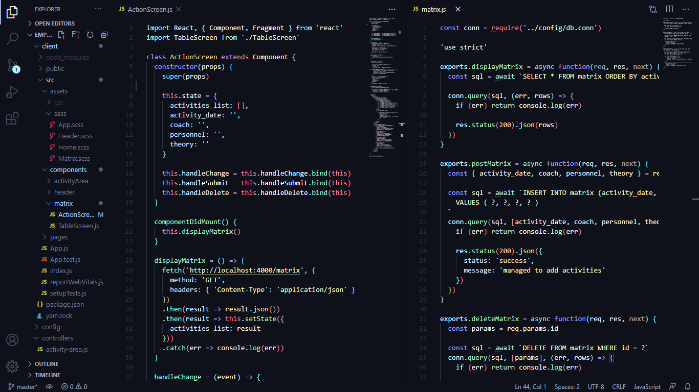

# Origami Theme
A simple theme with bright and elegant colors, making your coding activities even more comfortable. You can install it directly from the extensions tab in Visual Studio Code

  

 

This Theme is Released Under the [MIT License](https://github.com/febriadj/vscode-origami-theme/blob/master/LICENSE)

